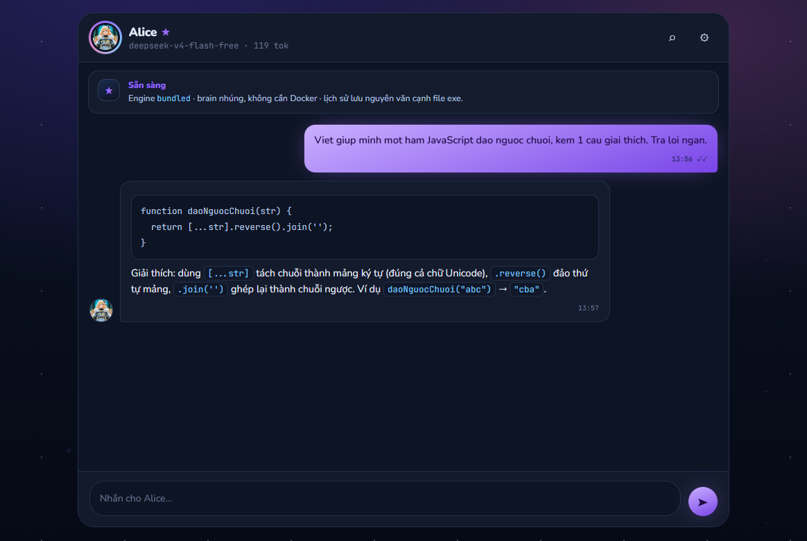
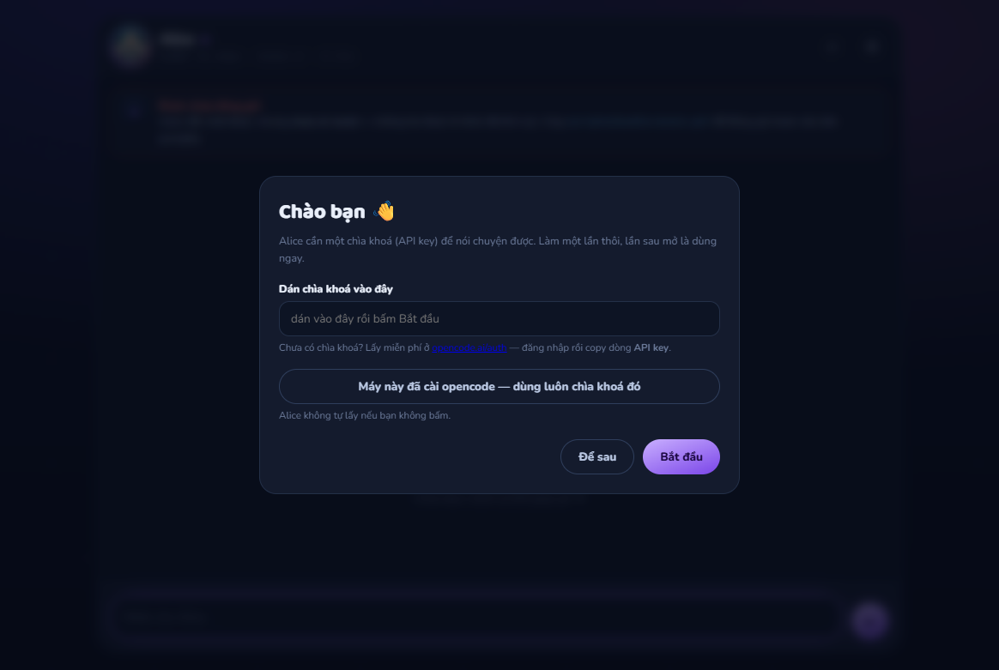

# Alice — bản portable

Alice chạy trên máy mình, trong một thư mục mang đi được. Mở lên là chat, không cần
cài đặt gì thêm, không cần Docker, không cần tài khoản Claude.



## Cài Alice

### Cách dễ nhất: bấm một link

Vào **[trang tải](https://github.com/blueberry-sensei/alice-portable/releases/latest)**
rồi tải file hợp với máy bạn:

| Máy bạn dùng | Tải file |
|---|---|
| Windows | `Alice-Setup-….exe` — bấm đúp là cài |
| macOS | `Alice-….dmg` — mở rồi kéo Alice vào Applications |
| Ubuntu / Linux | `Alice-….AppImage` — cấp quyền chạy rồi bấm đúp |

### Hoặc dán một dòng lệnh

**Windows** — dán vào **Command Prompt** hoặc **PowerShell**, cái nào cũng được:

```
powershell -NoProfile -Command "irm https://raw.githubusercontent.com/blueberry-sensei/alice-portable/main/install.ps1 | iex"
```

**macOS / Ubuntu** — dán vào **Terminal**:

```
curl -fsSL https://raw.githubusercontent.com/blueberry-sensei/alice-portable/main/install.sh | bash
```

> **Vì sao Windows phải viết dài thế?** Câu ngắn `irm … | iex` chỉ chạy trong
> PowerShell; dán vào Command Prompt là báo *"'irm' is not recognized"*. Câu dài ở
> trên chạy được ở **cả hai**, nên khỏi phải nhớ mình đang mở cửa sổ nào.

> Windows hiện bảng xanh *"Windows protected your PC"*? Bấm **More info** → **Run
> anyway**. macOS báo *"Alice cannot be opened"*? Chuột phải vào app → **Open** →
> **Open**. Cả hai hiện ra vì app chưa mua chữ ký số, không phải vì có virus.

### Máy cần gì trước không?

**Không.** Không cần Docker, không cần WSL, không cần cài Python hay Node. Alice mang
sẵn mọi thứ bên trong. Cứ tải về và cài.

---

## Vừa build xong trên máy này? Chạy luôn

Không phải cài gì thêm. App nằm ở:

```
dist\win-unpacked\Alice.exe
```

Bấm đúp là chạy. Lần đầu mở, dán API key vào màn hình chào (cách lấy ở dưới) là xong.

⚠️ Mỗi lần chạy `npm run build`, thư mục `dist\win-unpacked\` bị **dọn sạch và dựng
lại** — chìa khoá và lịch sử chat trong đó mất theo. Muốn giữ thì copy
`dist\win-unpacked\alice-data\` ra ngoài trước khi build.

---

# Phần 1 — Dành cho người dùng

*Nếu bạn vừa được đưa cho một thư mục tên `Alice`, đọc phần này là đủ. Không cần biết
lập trình.*

## Mở Alice lần đầu

Cài xong, mở Alice từ Desktop hoặc Start Menu. Alice hiện màn hình chào, xin một
**chìa khoá (API key)**:



Chìa khoá là thứ cho phép Alice gọi được model AI. Lấy như sau:

**Bước 1.** Mở <https://opencode.ai/auth> và đăng ký tài khoản.

**Bước 2.** Nhập thông tin thanh toán.

> Nghe hơi kỳ khi mình định dùng model miễn phí, nhưng OpenCode bắt buộc bước này
> cho mọi tài khoản. Có nhiều model **miễn phí thật** — dùng chúng thì không bị trừ
> tiền. Chỉ khi bạn tự chọn model trả phí trong Cài đặt mới phát sinh chi phí.
>
> Không muốn đưa thẻ? Nói với người đưa app cho bạn — họ đưa chìa khoá của họ được.

**Bước 3.** Trong trang tài khoản, copy dòng **API key**.

**Bước 4.** Quay lại Alice, dán vào ô, bấm **Bắt đầu**.

**Chỉ làm một lần.** Lần sau mở là chat được ngay.

## Chat

| Muốn | Làm |
|---|---|
| Gửi tin | Gõ rồi bấm **Enter** |
| Xuống dòng | **Shift + Enter** |
| Dừng khi Alice đang trả lời | Bấm nút tròn bên phải (nó đang là nút vuông ■) |
| Tìm lại chuyện cũ | Bấm **⌕** trên cùng. Gõ không dấu vẫn tìm ra |
| Đổi ảnh Alice, đổi model | Bấm **⚙** trên cùng |

Alice nhớ hết những gì đã nói, kể cả sau khi tắt app. Khi cuộc trò chuyện dài quá,
Alice tự tóm tắt phần cũ và nhớ tiếp — bạn không phải làm gì.

## Đổi ảnh Alice

Bấm **⚙** → **Đổi ảnh…** → chọn ảnh trong máy. Nhận PNG, JPG, WEBP, GIF dưới 8 MB.
Muốn quay lại ảnh cũ thì bấm **Về ảnh mặc định**.

Ảnh của bạn lưu ngay cạnh app nên **cập nhật không mất**.

## Cập nhật

Chạy lại đúng lệnh lúc cài:

```
irm https://raw.githubusercontent.com/blueberry-sensei/alice-portable/main/install.ps1 | iex
```

Nó tải bản mới nhất và cài đè. **Lịch sử chat, ảnh và chìa khoá của bạn giữ nguyên** —
chúng nằm trong `alice-data`, và bộ cài từ bản 0.1.3 trở đi **không đụng vào thư mục
đó** khi cài đè hay khi gỡ app.

> ⚠️ Các bản cũ hơn 0.1.3 (0.1.2 trở về trước) đã phát hành với bộ gỡ cài xoá sạch
> thư mục cài, nên nếu máy bạn đang chạy một bản CŨ, hãy copy thư mục `alice-data`
> ra ngoài **trước khi** cài đè bản mới, rồi đặt nó trở lại thư mục cài sau khi cài
> xong. Các bản từ 0.1.3 tự làm việc này.

## Gỡ Alice

Windows → **Settings → Apps** → tìm **Alice** → **Uninstall**.

Gỡ app **không xoá** lịch sử chat. Muốn xoá sạch, xoá thêm thư mục `alice-data` trong
nơi bạn đã cài Alice.

## Có gì không ổn?

| Hiện tượng | Cách xử lý |
|---|---|
| Thanh trên cùng báo **"Thiếu chìa khoá"** | Bấm **⚙**, dán API key vào ô *API key OpenCode*, bấm Lưu |
| Alice trả lời chậm hoặc báo lỗi model | Bấm **⚙** → Model → để trống ô đó. Alice sẽ tự đổi sang model khác khi một model hỏng |
| Lần đầu chat chờ hơi lâu | Bình thường, lần đầu app dựng vài thứ. Từ lần sau nhanh |
| Bấm mãi không lên | Mở lại. Nếu vẫn không, bấm **⚠** ở góc trên (màn hình chẩn đoán), bấm *Mở thư mục nhật ký*, rồi gửi cả thư mục `alice-data\logs` cho người đưa app |

> ⚠️ **Model miễn phí có thể dùng dữ liệu bạn gửi để huấn luyện.** Đừng gõ thông tin
> cá nhân, mật khẩu hay dữ liệu khách hàng vào model free — với những việc đó, chọn
> model trả phí trong **⚙**.

---

# Phần 2 — Dành cho người dựng bản

## Cần gì

| Thứ | Bản | Dùng lúc nào |
|---|---|---|
| Windows | 10/11 x64 | |
| [Node.js](https://nodejs.org) | **≥ 22** | Chỉ lúc build. Node 20 **không** build được — `electron-builder` kéo `@noble/hashes` v2 vốn ESM-only |
| [OpenCode](https://opencode.ai/docs) | bất kỳ | Chỉ lúc đóng gói, để lấy binary nhúng vào app |
| Python | 3.11+ | Chỉ lúc đóng gói bản **macOS/Linux**: bộ cài lấy python sẵn có để copy vào runtime (Windows dùng bản embeddable tự tải) |

Alice Brain **không cần gì thêm**: bộ cài mang sẵn phần chạy của brain (lấy từ
GitHub khi đóng gói). Không Docker, không container, không cần tri thức của ai — brain
rỗng tự dựng ở lần chạy đầu.

## Dựng

```bash
git clone https://github.com/blueberry-sensei/alice-portable.git
```

```bash
npm install
```

```bash
npm run bundle:opencode
```

```bash
npm run build
```

`npm run build` **tự nhúng cả brain**: `bundle-brain.ps1 -Source vendor` lấy
`sag_api` + `sag_agent` + `alicecore` (đều thuần Python) từ `brain-source/` ngay
trong repo rồi cài phần native bằng wheel đúng hệ điều hành — không cần Docker,
không cần quyền đọc hai repo nguồn (chúng là private; xem
[`brain-source/README.md`](brain-source/README.md)). Nguồn đó **đóng băng theo
release**: sau khi Alice Brain đổi, chạy lại lệnh này trước khi build:

```bash
npm run brain:sync-source
```

Bước này chỉ nhúng **phần chạy** của brain, **không** nhúng tri thức. `npm run build`
ra hai thứ trong `dist\`:

| Cái nào | Cho ai |
|---|---|
| `Alice-Setup-<ver>.exe` | **Người dùng cuối** — bấm đúp là cài. Đây là thứ upload lên Releases |
| `win-unpacked\` | Ai muốn bản mang đi được (USB), hoặc không có quyền cài |

Muốn dựng brain từ **brain đang chạy của chính mình** (không phải từ `brain-source/`)
thì dùng `bundle-brain.ps1 -Source container` (cần Docker + một Alice Brain đang chạy):

```bash
set ALICE_BRAIN_CONTAINER=ten-container-brain-cua-ban
powershell -ExecutionPolicy Bypass -File scripts\bundle-brain.ps1 -Source container
```

## Tri thức: Alice bắt đầu từ con số không

Bộ cài **không mang tri thức của ai theo**. Lần đầu chạy, app dựng một brain **rỗng**
(khoảng 3 giây) rồi Alice tự đắp dần khi làm việc — đúng cách
[ALICE CODING](https://github.com/blueberry-sensei/alice-coding) hoạt động: năm lớp
`wiki` / `decisions` / `mistakes` / `context` / `changelog`, ghi theo từng lượt.

Hai lý do, và lý do đầu quan trọng hơn:

1. **Tri thức của một project là dữ liệu của người đó.** Nhét brain của project A vào
   bộ cài phát cho người B là phát tán dữ liệu nhầm chỗ. Bản đầu của script build ở
   đây đã làm đúng lỗi đó — 546 MB nhật ký quyết định của một khách hàng suýt đi vào
   một repo public.
2. Bỏ ra thì bộ cài từ ~1,9 GB xuống **~350 MB**, lọt trần 2 GB của GitHub Release,
   và CI dựng được cho cả ba hệ điều hành.

Bộ cài cũng **không** chứa `alice.db` (lịch sử chat), **không** chứa API key,
**không** chứa `.secret_key`.

Muốn nạp sẵn tri thức của **chính bạn** vào bản bạn tự dùng:

```bash
npm run import:brain-data
```

Nó chép `sag.db` + LanceDB từ brain của bạn vào `alice-data\` — tức là vào **bản dùng
riêng**, không vào bộ cài đem phát.

## Phát hành cho khách

```bash
npm run build
```

```bash
set GITHUB_TOKEN=token-cua-ban
```

```bash
npm run release
```

Script tạo release, upload bộ cài, rồi in ra đúng dòng lệnh để đưa khách. Token tạo ở
<https://github.com/settings/tokens> với quyền **contents: write** — script không lưu
và không in nó ra đâu cả.

⚠️ GitHub chặn asset **> 2 GB**. Script kiểm trước khi upload để không tốn một tiếng
rồi mới bị từ chối. Chạm trần thì tỉa `runtime\brain` hoặc tách tri thức thành bản
tải riêng.

## Alice của bạn, không phải Alice của tôi

App này là cái **vỏ**; Alice bên trong do bạn nạp:

| Thay gì | Ở đâu |
|---|---|
| Tính cách, luật làm việc | `knowledge\ALICE.md` — app ghép thành `AGENTS.md` mỗi lần khởi động |
| Tri thức để tra cứu | brain bạn trỏ tới bằng `ALICE_BRAIN_CONTAINER` |
| Ảnh | `src\renderer\assets\img\alice-default.png`, hoặc để người dùng tự đổi trong app |
| Model | trong Cài đặt |

Không có gì trong repo này ghi cứng một project cụ thể.

## Dữ liệu nằm ở đâu

Tất cả trong `alice-data\` cạnh file exe:

```
alice-data/
  alice.db          lịch sử chat, nguyên văn, không bao giờ xoá
  settings.json     model, trần ngữ cảnh, cấu hình nén
  avatar.png        ảnh người dùng tự chọn (nếu có)
  brain/            SQLite + LanceDB của Alice Brain
  logs/             nhật ký lỗi (bấm ⚠ trong app để xem hoặc mở thư mục này)
  opencode/         auth + session của engine
```

Không có gì gửi đi đâu ngoài chính lượt chat tới provider bạn chọn.

## Kiến trúc — ba tiến trình

| Thành phần | Là gì | Chạy bằng |
|---|---|---|
| UI | Electron renderer dựng theo design system DREAM | Electron 40 (Node 24) |
| Engine | `opencode run --session` mỗi lượt | `runtime\opencode\opencode.exe` |
| Brain | MCP stdio, **in-process**, không HTTP | `runtime\brain\python\python.exe -m sag_api.mcp.server` |

Không dùng `opencode serve`: đã đo, `opencode run --session ses_…` **nối tiếp session
thật**, nên CLI là đủ và bớt được một tiến trình. Brain cũng không cần HTTP sidecar —
MCP của nó chạy in-process với engine.

Cấu hình MCP **sinh lúc chạy**, với đường dẫn tuyệt đối tới runtime nhúng trong app.
Không `npx`, không `python` trần: PATH của máy không được quyền quyết định app chạy
bằng runtime nào.

## Trí nhớ hoạt động thế nào

Kho của app là **source-of-truth**; session của opencode chỉ là *cache*, mất thì dựng
lại được.

- Mọi tin lưu **nguyên văn** vào SQLite. FTS5 `remove_diacritics 2` → gõ `nha hang`
  tìm ra `nhà hàng`.
- Độ đầy cửa sổ đo bằng token engine **trả về thật**, và tính cả `cache.read` — không
  chỉ `input`. Có prompt-cache thì `input` lượt sau có thể *nhỏ hơn* lượt đầu dù hội
  thoại dài ra; chỉ nhìn `input` là không bao giờ nén.
- Chạm 80% cửa sổ (mặc định 60% trần model) → nén phần cũ, **xoay sang session mới**,
  nạp mồi = bản tóm tắt + 40 tin cuối nguyên văn.
- Mỗi ngày xoay một lần, mang bản compact của ngày cũ theo.

Mồi lưu **trên đĩa**, không giữ trong RAM: lượt xoay và lượt tiêu thụ mồi là hai lượt
khác nhau, app có thể bị tắt ở giữa. Bản đầu giữ trong biến và test bắt được — đó
đúng là ca *"quên từ lượt thứ HAI mà vẫn trả lời trơn tru"*, kiểu lỗi không lộ ra khi
thử bằng tay.

## Phát triển

```bash
npm start
```

```bash
npm test
```

Test chạy bằng **Electron-as-node**, không bằng `node` của máy: `node:sqlite` cần
Node ≥ 22, và chạy trên Electron nghĩa là test chạy đúng runtime sẽ ship. Bỏ phần gọi
mạng bằng `ALICE_SKIP_E2E=1`. 14 test, gồm engine thật và MCP brain thật.

| Lệnh | Làm gì |
|---|---|
| `npm start` | Chạy từ nguồn |
| `npm test` | Toàn bộ test |
| `npm run assets` | Sinh lại font từ file design system |
| `npm run bundle:opencode` | Nhúng binary opencode |
| `npm run bundle:brain` | Nhúng Alice Brain (nguồn từ `brain-source/`) |
| `npm run brain:sync-source` | Đồng bộ nguồn brain mới từ hai repo nguồn |
| `npm run import:brain-data` | Nạp tri thức vào brain nhúng |
| `npm run build` | Đóng gói |

## Bẫy đã dính, ghi lại để khỏi dính lại

| Triệu chứng | Nguyên nhân |
|---|---|
| Engine im lặng tới lúc timeout, mà chạy tay thì 4 giây xong | `spawn()` mặc định để **stdin là pipe mở**; `opencode run` nhận nội dung qua stdin nên nó chờ EOF vĩnh viễn. Phải `stdio: ['ignore','pipe','pipe']`. Nhìn từ ngoài y hệt "model chậm" |
| Bản đã đóng gói chết lúc tạo `alice-data` | `__dirname` nằm trong `resources/app.asar`, nên `../..` ra đường dẫn **bên trong asar**. Bản packaged phải neo vào `path.dirname(app.getPath('exe'))` |
| Cài đè bản mới lên bản cũ mất sạch lịch sử chat | Uninstaller mặc định của electron-builder chạy `RMDir /r $INSTDIR`, mà `alice-data` nằm NGAY trong đó. Phải tự định nghĩa `customRemoveFiles` (+ backup/restore trong `customInit`/`customInstall`) trong `build/installer.nsh` |
| Lượt chat đầu treo vài phút trên máy mới | opencode tự `npm install` plugin vào `XDG_CONFIG_HOME` trống. App ship sẵn `runtime/opencode-config/` để tránh |
| Build chết ở `ERR_REQUIRE_ESM` | Đang chạy `electron-builder` bằng Node 20. Cần Node ≥ 22 |
| `.ps1` báo lỗi cú pháp ở dòng không liên quan | PowerShell 5.1 đọc `.ps1` **không BOM** theo ANSI → chữ tiếng Việt thành rác, vỡ parser. Chạy `node scripts/fix-ps1-encoding.js` |
| `Cannot proceed with byte encoding` | PS 5.1 biến stdout của native command thành **chuỗi** — không pipe được nhị phân |
| `docker cp` một thư mục ra `/mnt/…` bò ~1MB/phút | 9p của WSL + hàng chục nghìn file nhỏ. Tar thành **một** file rồi giải nén bằng `tar` của Windows |
| Khối `hidden` vẫn hiện | `display` do class đặt thắng `display:none` mà trình duyệt gán cho `[hidden]` |

## Phát hành ba hệ điều hành

`.dmg` chỉ dựng được trên macOS, `.AppImage` chỉ dựng được trên Linux — không
cross-build từ Windows. Nên việc đó giao cho **GitHub Actions**
([`.github/workflows/release.yml`](.github/workflows/release.yml)): ba runner
`windows-latest` / `macos-latest` / `ubuntu-latest`, đẩy một tag là ra cả ba file và
tự đăng lên Releases.

```bash
npm version patch
```

```bash
git push --follow-tags
```

CI có một chốt chặn cố ý: **fail nếu thấy `runtime/brain-seed` hoặc `alice-data`**
lúc đóng gói. Bộ cài không bao giờ được mang tri thức của ai theo.

CI **tự** dựng phần chạy của brain trên cả ba hệ điều hành (bước `bundle-brain.ps1
-Source github` — nguồn từ GitHub, không cần container). Người dùng mới không thiếu
gì: Alice tự dựng brain rỗng ở lần chạy đầu, và bộ cài đã có sẵn Python + thư viện
để recall chạy ngay.

### Còn thiếu

- **Auto-update** — chưa có; cập nhật bằng cách chạy lại lệnh cài (dữ liệu giữ nguyên, xem mục *Cập nhật*).
- **Chữ ký số** — nên Windows SmartScreen và macOS Gatekeeper sẽ cảnh báo lần đầu.
- **Wizard chọn embedding local hay API** — hiện đọc từ `settings.json`.
- `runtime\brain` nặng ~900 MB, tỉa được: `markitdown`, `onnxruntime`, `pandas` chỉ
  cần cho ingest tài liệu, recall không đụng tới.

## Giấy phép

[MIT](LICENSE) © 2026 Blueberry Sensei.

Alice Brain và OpenCode là phần mềm riêng của tác giả chúng, có giấy phép riêng; repo
này chỉ đóng gói chứ không sở hữu. Font Nunito / Baloo 2 / JetBrains Mono theo
SIL Open Font License.
